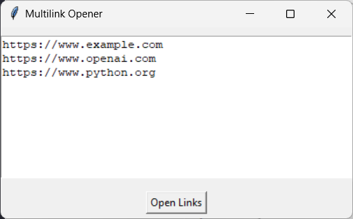

# Multilink Opener

The Multilink Opener is a simple Python application that allows users to input multiple URLs and open them in new tabs in Google Chrome (default) or any other browser. This tool is particularly useful for quickly accessing multiple web pages without having to copy and paste each link individually into the browser.



## Features

- Input multiple links in a text area, one per line.
- Open all entered links in new browser tabs with a single button click.
- User-friendly interface built with Tkinter.

## Requirements

- Python 3.11
- Tkinter (comes pre-installed with most Python distributions)
- Google Chrome (ensure it is installed on your system)

## Installation

1. **Clone the Repository**:
   ```bash
   git clone https://github.com/stevillis/multilink-opener.git
   cd multilink-opener
   ```

2. **Ensure Python is Installed**: Download and install Python from [python.org](https://www.python.org/downloads/).

3. **Run the Application**:
    ```bash
    python app.py
    ```

## Usage

1. **Input Links**: In the text area, paste or type the URLs you want to open, with each link on a new line.

2. **Open Links**: Click the "Open Links" button. Each link will open in a new tab in your default web browser (Google Chrome).

## Example

```plaintext
https://www.example.com
https://www.openai.com
https://www.python.org
```

After entering the links above and clicking "Open Links", each URL will open in a new Chrome tab.

## Troubleshooting

- **Chrome Not Opening Links**: Ensure that Google Chrome is installed and set as the default browser on your system. If Chrome is not the default browser, you may need to modify the `BROWSER_PATH = "C:/Program Files/Google/Chrome/Application/chrome.exe"` line in the code of `app.py` to specify the path to your executable browser.
